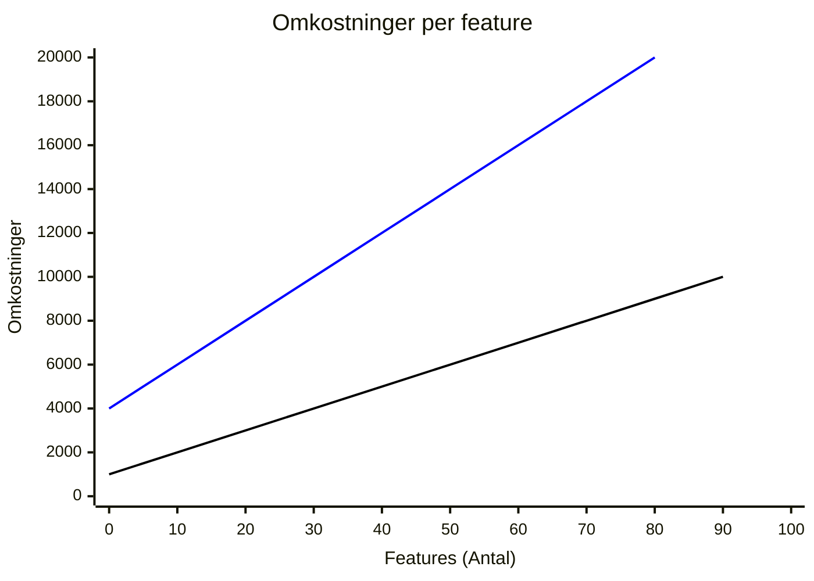

# Arkitektur

Når man udvikler i .NET til webapplikationer, spiller valg af arkitektur en afgørende rolle for, hvordan systemet struktureres, vedligeholdes og skaleres. To populære arkitekturer er Clean Architecture (lagdelt arkitektur) og Vertical Slice Architecture (lodrette skiver).

Begge arkitekturer har deres styrker og kan tilpasses forskellige behov, uanset om systemet bygges som en monolith eller som et distribueret system – enten ved hjælp af en central API eller gennem microservices.

Begge arkitekturer understøtter principperne om high cohesion og loose coupling, men på forskellige måder

## Arkitektur varianter

# [Clean Architecture](#tab/ca)

[Steven Smith om CA](https://www.youtube.com/watch?v=yF9SwL0p0Y0&t=1s)

**Sådan fungerer det**
Clean Architecture fremmer high cohesion (høj sammenhængskraft) og loose coupling (løs kobling) gennem en lagdelt struktur og abstraktioner. Hvert lag har et klart ansvar, og afhængigheder går kun én vej – fra de ydre lag mod de indre lag.

**High Cohesion**  
Alle elementer i hvert lag har en tæt sammenhæng, da de fokuserer på ét specifikt ansvar.
Dette gør hvert lag fokuseret og let at forstå.

**Loose Coupling**  
Lagene er uafhængige af hinanden og interagerer kun via interfaces.
Et lag kender kun til de abstraktioner, det afhænger af, og ikke de konkrete implementeringer.

**Fordele**  

- **Forudsigelighed og konsistens**  
Når man skal implementere en ny feature, ved man præcis, hvordan den skal opdeles, fordi hver del af koden har en fast plads i hver sit lag, da hele kodebasen er bygget op på samme måde.

- **Modelering**  
Når der allerede er fastlagt klare programmeringsmønstre, gør det det muligt at modellere på low-level niveau med diagrammer som fx [TODO: indsæt diagramnavne], for en feature, allerede inden at man går i gang med at implementere koden.

- **Testbarhed**  
  
  - Man kan planlægge og skrive tests for hver feature, allerede før implementeringen, da man ved hvilke dele af applikationen der skal testes, og hvad der skal testes for.

  - Det muliggør brugen af Unit Test Driven Design (UTDD), hvor tests fungerer som en guide for implementeringen.
  Brugen af interfaces gør det nemt at sikre, at både "happy paths" og "edge cases" dækkes gennem tests. Interfaces sikrer en kontrakt, der kun dækker returtyper og argumenter, men ikke forretningslogikkens kanttilfælde.

  - Ved at skrive unit tests for interfaces kan man validere, at implementeringer opfører sig korrekt i alle scenarier.

  - Et særskilt Core-testprojekt kan anvendes til at teste hele Core-laget, hvor forretningslogikken er placeret, og sikrer, at alle interfaces er dækket og overholder deres kontrakter.

- **DRY**  
  Man kan genbruge de enkelte dele i et lag, i forskellige dele i et andet lag.

- **Udvidelighed**  
Arkitekturen gør det nemt at udskifte eller ændre dele af systemet.
Hvis man fx ønsker at skifte EF Core ud med en anden ORM eller database, behøver man kun at opdatere Repository implementationerne, uden at det påvirker resten af applikationen.

**Ulemper**  

- **Overhead og fragmentering**  

  - Features skal opdeles i mange små filer og lag, hvilket kan føles overflødigt i mindre eller simple projekter.
  
  - Den samme struktur skal følges i hele applikationen, selvom i simple features

- **Gengbrug af objekter**  
Genbrug af dele fra 1 lag i et andet kan føre til problemer, hvis der opstår ændringer eller fejl.
Hvis et objekt i et lag ændres, kan det påvirke alle de dele, der genbruger den – både i det samme lag og på tværs af lag. Dette betyder, at en enkelt fejl kan spredes til flere steder i systemet og skabe uforudsete problemer.
Derfor er det vigtigt at unit teste alle interfaces.

- **Overblik**  
Som udvikler kan det være svært at skabe sig et overblik over hvilke dele der er afhængig af andre dele, da en feature er spredt ud på flere lag, hvilket gør det svært for nye udviklere at sætte sig ind i kodebasen

- **Modelering**  
Det gør det også svært at automatisere dokumentation via UML diagrammer, da en feature er delt ud på flere lag og flere objekter i 1 lag kan have den samme afhængighed i laget under

- **Overflødig brug af repositories og interfaces**  
Et almindeligt argument i .NET-verdenen er, at repositories og interfaces gør det lettere at skifte database. Men i praksis fungerer EF Core allerede som et repository via DbContext og understøtter mange forskellige databaser

- **Tests**
  - Da objekter kan bruges på tværs af lag, kan det skabe side effekter i andre dele af applikationen.
    Derfor er det nødvendigt med fokus på at man unit tester interfaces i isolation, for at mindske fejl i systemet.

# [Vertical Slice Arkitektur](#tab/vsa)

[Jimmi Bogard om VSA](https://www.youtube.com/watch?v=oAoaMlS1PWo&t=1s)

**Sådan fungerer det**  
Vertical Slice Architecture opnår high cohesion (høj sammenhængskraft) og loose coupling (løs kobling) ved at fokusere på at samle al kode, der relaterer sig til én specifik feature, i én "slice". Hver slice er en autonom enhed, der kun afhænger af det, den selv har brug for.

**High Cohesion**  
Fokuserer på high cohesion ved at samle alt, der relaterer til en feature, ét sted.

**Loose Coupling**  
Opnår loose coupling ved at holde slices uafhængige af hinanden.

**Fordele**

- **Overblik**  
  - Det er nemmere at overskue en feature, når al kode relateret til den ligger i samme mappe, fremfor at være spredt ud over flere mapper og projekter.  
  - Selv i et distribueret system med Client-, Server- og Shared-projekter forbliver strukturen overskuelig, da mapperne har samme navne og er organiseret på samme måde.  
  - Da koden er opdelt per feature, bliver det nemmere for nye udviklere at sætte sig ind i kodebasen og forstå, hvordan den fungerer.

Debugging bliver enklere, fordi al relevant kode til en feature er samlet ét sted.

Features er isolerede fra hinanden. Ændringer i én feature påvirker ikke andre og har ingen sideeffekter, hvilket giver udviklere større tryghed, når der deployes til produktion.

Udviklere har større frihed til at implementere kode på den måde, de finder bedst. En feature kan betragtes som en "black box", der kun interagerer gennem requests og responses.

Integrationstests kan nemt implementeres og dække hele systemet på højeste niveau, da al påvirket kode er samlet ét sted. Samtidig sikrer unit tests i domænelaget, at delt forretningslogik fungerer korrekt.

Selvom det er valgfrit, kan unit tests stadig bruges til komplekse metoder for at spare tid og reducere debugging. Dette kan sammenlignes med at unit teste private metoder, som understøtter public metoder. På samme måde understøtter metoder i et snit en feature i at overholde kravene.

Pull requests bliver mere overskuelige at gennemgå, da alle ændringer relateret til en feature er samlet ét sted, hvilket også gør historikken nemmere at spore.

#### Ulemper

Da der ikke er kode, der deles på tværs af lagene, kan det føre til gentagelser (mod DRY-princippet).
Men i praksis kan det være mere hensigtsmæssigt at gentage sig selv i visse tilfælde fremfor at abstrahere for meget. Erfaring er nøgleordet her.

Delt forretningslogik kan stadig placeres i domænelaget, hvor det giver mening, for at undgå overflødig gentagelse.

**Modelering**  
Fokus bør være på high-level diagrammer, der er relevante for interessenterne, da de typisk ikke interesserer sig for implementeringsdetaljer.

Det er muligt at modellere på low-level niveau, men ofte er det mere effektivt at lade udviklere, der implementerer featuren, tage sig af detaljerne. En TDD-tilgang kan her være fordelagtig, hvor kode og tests dikterer implementeringen.

Ved at prioritere high-level diagrammer frigives der mere tid til at designe systemet på en måde, der betyder noget for interessenterne.

Low-level modellering:
Det er muligt at modellere på low-level niveau, som f.eks. sekvensdiagrammer eller klasse-diagrammer, især når programmeringsmønstre er fastlagt. Dog øger dette kompleksiteten, da sporbarhed mellem design og kode skal opretholdes.
Low-level design bør kun bruges, hvis en udvikler ønsker et overblik over en feature før implementering. Interessenter bekymrer sig sjældent om implementeringsdetaljer.

**Tests**  
Hver feature-mappe er isoleret fra andre, hvilket gør det nemt at debugge og rette fejl uden at risikere sideeffekter i andre features.

Den mest effektive testtilgang i VSA er en ATDD-tilgang med fokus på endpoints.

Unit tests:
Det anbefales kun at bruge unit tests for komplekse metoder, hvor de kan spare tid ved at eliminere behovet for gentagen debugging.

Da alle features har adgang til domænelaget, er det vigtigt at unit teste forretningslogikken i dette lag. Fejl i domænelaget kan have sideeffekter på tværs af flere features, og derfor bør det testes grundigt.

I domænelaget er det ikke nok kun at dække kode med interfaces. Interfaces sikrer kun en begrænset kontrakt med fokus på return-typer og parametre, hvilket kan føre til, at edge cases overses.
Derfor er det vigtigt at lave unit tests for interfaces, så alle edge cases i domænet dækkes. Dette gøres bedst med et dedikeret domæne-testprojekt.

---

### Monolith vs Distribueret system

# [CA Interactive Server eksempel](#tab/interactive-server/ca)


```plantuml
!define BG_COLOR_CHILD #FFF9B1
skinparam dpi 60
skinparam packageBackgroundColor BG_COLOR_CHILD

top to bottom direction

package "UI" {
  [Component.cs] as Component
  [ViewModel.cs] as ViewModel
  [Endpoint.cs] as Endpoint
}

Component --> ViewModel
ViewModel --> Endpoint

package "Infrastructure" {
  package "InfrastructureServices" {
    [InfraService.cs] as InfraService
  }
  package "DataAccess" {
    [Repository.cs] as Repository
  }
  package "EfCore" {
    [Migrations.cs] as Migrations
    [DbContext.cs] as DbContext
  }
}

package "ApplicationCore" {
  package "DomainServices" {
      [DomainService.cs] as DomainService 
  }
  package "Interfaces" {
    [IDomainService.cs] as IDomainService
    [IInfraService.cs] as IInfraService
    [IRepository.cs] as IRepository
  }
  package "Domain" {
    [Entity.cs] as Entity
  }
}

IDomainService ..> DomainService
DomainService --> IRepository
Endpoint --> IDomainService
IRepository ..> Repository
Repository --> DbContext
DomainService --> IInfraService
IInfraService ..> InfraService
Endpoint --> IInfraService
IRepository --> Entity

```

# [CA Interactive WebAssembly (TODO)](#tab/interactive-webassembly/ca)

CA interactive webassembly

# [VSA Interactive Server eksempel](#tab/interactive-server/vsa)


```plantuml
!define BG_COLOR_CHILD #FFF9B1
skinparam packageBackgroundColor BG_COLOR_CHILD

package "Simpel Feature" {
  [Component.razor] as SimpleComponent
}

package "Kompleks Fetature" {
  [Component.razor] as ComplexComponent
  [ViewModel.cs] as ComplexViewModel
  [IRepository.cs] as ComplexIRepository
  [Repository.cs] as ComplexRepository
}

ComplexComponent --> ComplexViewModel
ComplexViewModel --> ComplexIRepository
ComplexIRepository --> ComplexRepository
```

# [VSA Interactive WebAssembly eksempel](#tab/interactive-webassembly/vsa)


<div class="uml-vsa" style="display: flex;">
  <div class="uml-vsa__server">

<h5 style="text-align: center; margin-top: 5%">Simple Features</h5>

```plantuml
!define BG_COLOR #FFF9B1
skinparam packageBackgroundColor BG_COLOR
left to right direction
 
package "Client" {
  [Component.razor] as Component
}

package "Server" {
  [Endpoint.cs] as Endpoint
}

package "Shared" {
  [DTO.cs] as DTO
  [Validation.cs] as Validation
  
}

Client --> Shared
Server --> Shared
DTO --> Validation
```

  </div>

<div class="uml-vsa__webassembly">
  <h5 style="text-align: center; margin-top: 5%">Komplekse Features</h5>

```plantuml
!define BG_COLOR #FFF9B1
skinparam packageBackgroundColor BG_COLOR

package "Client" {
  [Component.razor] as Component
  [Service.cs] as ClientService
}

package "Server" {
  [Endpoint.cs] as Endpoint
  [IService.cs] as IService
  [Service.cs] as Service
  [Mapper.cs] as Mapper
  [IRepository.cs] as IRepository
  [Repository.cs] as Repository
}

package "Shared" {
  [DTO.cs] as DTO
  [Validation.cs] as Validation
}

Component --> ClientService

ClientService --> Endpoint
Client --> DTO
Endpoint --> IService
IService --> Service
Service --> Mapper
Server --> DTO
Service --> IRepository
IRepository --> Repository
DTO --> Validation
```

  </div>
</div>

---

## Omkostninger

##### Udvikling

- **VSA**
  - Hurtig start med minimal kompleksitet, da hver feature bygges som en selvstændig enhed uden behov for omfattende arkitektoniske overvejelser.
  - Udviklingstiden er generelt kortere, fordi der ikke kræves mange abstraktioner, og der er mindre fokus på at etablere komplekse lag.
  - Da hver feature bygges som en selvstændig enhed, kan den også testes isoleret, hvilket reducerer kompleksiteten i testprocessen.

- **CA**
  - Høj kompleksitet fra start, da man allerede inden den første linje kode skal oprette flere projekter og definere lag og abstraktioner.
  - Den omfattende brug af interfaces og unit tests betyder, at udviklingen tager længere tid.
  - Hver feature, der implementeres, har en høj kompleksitet, som ikke kan reduceres, da arkitekturens regler er hugget i sten.

##### Vedligehold

- **VSA**
  - Lav kompleksitet fra start gør det lettere at forstå og tilpasse eksisterende features.
  - Hver feature er fleksibel og kan have enten lav eller høj kompleksitet afhængigt af behov og udviklerens tilgang.
  - Når projektet vokser, kan vedligeholdelsesomkostningerne stige, **hvis** features ikke holdes tilstrækkeligt adskilte, da manglende struktur kan føre til overlap og uforudsigelige afhængigheder.
  - Da hver feature kan testes som en selvstændig enhed, bliver det lettere at identificere og løse problemer da de er isoleret i 1 feature, hvilket mindsker kompleksiteten ved vedligeholdelse.
  - Forskellige features kan have objekter der gør præcis det samme, så hvis at der ændres noget i såadan et objekt, skal det ændres i flere forskellige features.

- **CA**  
  - Når koden er spredt ud på mange små filer og lag, kan det være mere udfordrende at gennemgå pull requests og få et samlet overblik over ændringerne. Dette gør godkendelse af pull requests mere tidskrævende.
  - Ændringer i kravene kræver ofte, at flere lag opdateres, hvilket kan være tidskrævende. Derudover skal alle berørte unit tests skrives om, hvilket yderligere forlænger vedligeholdelsestiden.
  - De firkantede regler og omfattende brug af abstraktioner gør det svært at implementere hurtige ændringer eller prototyper.

**CA** (blå linie)

- Høj kompleksitet fra start, da man allerede inden den første linje kode har oprettet flere projekter i applikationen.
- Hver feature, der implementeres, har høj kompleksitet, som ikke kan reduceres.

**VSA** (mellem blå og sort linie)

- Lav komplesitet fra start.
- Hver feature, der implementeres, er fleksibel og kan have enten lav eller høj kompleksitet afhængigt af behov.



##### Drift

- ###### Skalering
  
  - ###### VSA  
  
    - ###### UI
  
    - I en server-rendered applikation er det mere kompliceret at skalere hele UI, da komponenter er opdelt i individuelle features. Dette kan gøre det vanskeligt at allokere ressourcer samlet til UI. 
    - Den nemmeste løsning for at skalere hele UI samlet i en server-rendered applikation vil ofte være at skalere hele applikationen. Dette kan dog føre til, at ressourcer også bliver tildelt dele, der ikke nødvendigvis har brug for det.

    - **Andre dele af kodebasen:**
    - Det er nemt at identificere og optimere specifikke dele af en feature, som for eksempel
      ressourcetunge endpoints eller databaser.
    - Domain- og Infrastruktur-lag kan skaleres uafhængigt for at imødekomme krav om øget belastning.

  - ###### CA
  
    - ###### UI

    - I server-rendered applikationer kan man nemt dynamisk skalere de forskellige lag baseret på efterspørgsel, da hele UI er samlet ét sted.
    - Man kan samtidigt skalere individuelle komponenter for at håndtere specifikke belastninger.

    - ###### Andre dele af kodebasen
  
    - Lagene i CA-arkitekturen kan skaleres individuelt, hvilket gør det muligt at optimere eksempelvis applikationslaget eller databasen afhængigt af belastning.
    - Ved at have en klar adskillelse mellem lagene er det nemmere at justere ressourcerne for specifikke behov uden at påvirke de øvrige lag negativt.
