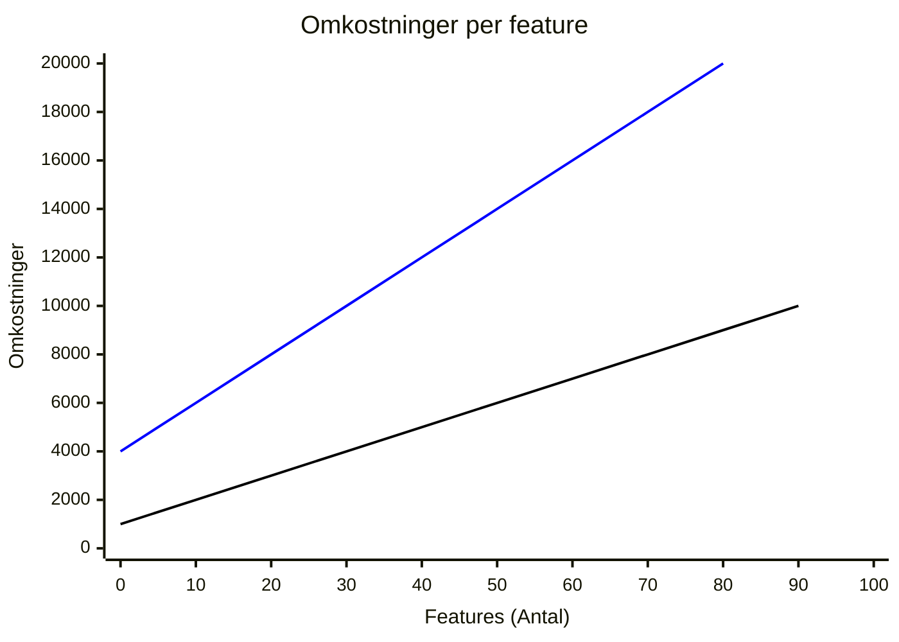

# Arkitektur

Når man udvikler i .NET til webapplikationer, spiller valg af arkitektur en afgørende rolle for, hvordan systemet struktureres, vedligeholdes og skaleres. To populære arkitekturer er Clean Architecture (lagdelt arkitektur) og Vertical Slice Architecture (lodrette skiver).

Begge arkitekturer har deres styrker og kan tilpasses forskellige behov, uanset om systemet bygges som en monolit eller som et distribueret system – enten ved hjælp af en central API eller gennem microservices.

Clean Architecture fokuserer på at adskille applikationens forretningslogik fra tekniske detaljer. Den giver en tydelig lagdeling, der gør det nemt at vedligeholde og teste systemet, især i større løsninger.
Vertical Slice Architecture tager derimod udgangspunkt i funktionalitet frem for lag, hvilket betyder, at hver feature behandles som en selvstændig enhed med sin egen logik, dataadgang og præsentationslag. Denne tilgang kan gøre koden mere fokuseret og nemmere at navigere, især i projekter med høj kompleksitet eller mange uafhængige features.
Valget mellem de to arkitekturer afhænger ofte af projektets størrelse, kompleksitet og behovet for fleksibilitet. Mens Clean Architecture er ideel til større projekter, hvor strukturel klarhed er altafgørende, er Vertical Slice Architecture oplagt, når man ønsker at undgå overflødige lag og i stedet fokusere på funktionelle enheder.

Når man kombinerer disse arkitekturer med forskellige implementeringsformer (monolit eller distribueret system), er der også andre faktorer at tage højde for, såsom skalerbarhed, teamets størrelse og behovet for uafhængig udvikling af forskellige dele af systemet.

## Arkitektur varianter

# [Clean Architecture](#tab/ca)

[Steven Smith om CA](https://www.youtube.com/watch?v=yF9SwL0p0Y0&t=1s)

#### Fordele

**Tydelig adskillelse af ansvar**  
Hvert lag har et klart og veldefineret ansvar, hvilket gør det nemmere at forstå og vedligeholde koden.

**Testbarhed**  
Du kan planlægge og skrive unit tests allerede før implementeringen, da du ved, hvilke dele af applikationen der skal testes, og hvad der skal testes for. Dette muliggør brugen af Unit Test Driven Design (UTDD), hvor tests fungerer som en guide for implementeringen.

- Brugen af interfaces gør det nemt at sikre, at både "happy paths" og "edge cases" dækkes gennem tests. Interfaces sikrer en kontrakt, der kun dækker returtyper og argumenter, men ikke forretningslogikkens kanttilfælde. Ved at skrive unit tests for interfaces kan man validere, at implementeringer opfører sig korrekt i alle scenarier.
- Et særskilt Core-testprojekt kan anvendes til at teste hele Core-laget, hvor forretningslogikken er placeret, og sikrer, at alle interfaces er dækket og overholder deres kontrakter.

**Udvidelighed**  
Arkitekturen gør det nemt at udskifte eller ændre dele af systemet. Hvis du fx ønsker at skifte EF Core ud med en anden ORM eller database, behøver du kun at opdatere UserRepository, uden at påvirke resten af applikationen.

**Forudsigelighed og konsistens**  
- Når du arbejder på en ny feature, ved du præcis, hvordan den skal opdeles, fordi hver del af koden har en fast plads i strukturen.
- Hele kodebasen er bygget op på samme måde, hvilket giver en ensartet struktur og gør det lettere for teamet at navigere og samarbejde.

**Overholdelse af SOLID-principper og DRY**  
Denne arkitektur lægger ofte vægt på at følge SOLID-principperne (Single Responsibility, Open/Closed, etc.) og DRY-princippet (Don't Repeat Yourself). Dette skaber en mere struktureret og genanvendelig kode.

**Modellering på low-level niveau**  
Når der allerede er fastlagt klare programmeringsmønstre, gør det det muligt at modellere på low-level niveau med diagrammer som fx [indsæt diagramnavne].

- Low-level design giver et overblik over specifikke features, inden de bliver implementeret. Dette er især nyttigt for udviklere, der ønsker en visuel forståelse af, hvordan dele af systemet fungerer.
- Dog øger det kompleksiteten at sikre sporbarhed mellem design-diagrammer og kode. Interessenter fokuserer sjældent på den konkrete implementering, men på interaktiviteten. Derfor bør low-level design kun bruges som et værktøj til udviklere, ikke som et krav.

**Løs kobling mellem lag**  
Brugen af interfaces fremmer løs kobling, hvilket gør det nemt at skifte lag ud, fx at erstatte en service eller et repository.

#### Ulemper

**Overhead og fragmentering**  
- Enkel kode skal opdeles i mange små filer og lag, hvilket kan føles overflødigt i mindre eller simple projekter.
- Den samme struktur skal følges i hele applikationen, selvom det måske ikke er nødvendigt i alle dele.

**Låst fast i et mønster**  
Koden bliver bundet til en bestemt arkitektur allerede fra starten, hvilket kan begrænse fleksibiliteten, hvis kravene ændrer sig senere. Det giver udvikleren nogle meget stramme rammer for hvordan at de kan implementere en feature.

**Kompleksitet i projektstruktur**  
Nogle arkitekturer placerer lagene i separate projekter i stedet for blot foldere. Dette kan gøre det lettere at udskifte lag, men øger samtidig den samlede kompleksitet og kan være unødvendigt, hvis der ikke er behov for at skifte lagene ud senere.

**Overflødig brug af repositories og interfaces**  
Et almindeligt argument i .NET-verdenen er, at repositories og interfaces gør det lettere at skifte database. Men i praksis fungerer EF Core allerede som et repository via DbContext og understøtter mange forskellige databaser. Derfor kan det virke som overengineering at bygge et ekstra lag ovenpå.

**Tidskrævende implementering**  
Den høje brug af interfaces og unit tests betyder, at udviklingen tager længere tid. Samtidig øger det kompleksiteten i både implementeringen og vedligeholdelsen af koden.

**Kompleksitet i pull requests**  
Når kode er spredt ud på mange små filer og lag, bliver det mere udfordrende at gennemgå pull requests og få et overblik over de ændringer, der er lavet. Dette kan også gøre det vanskeligere og mere tidskrævende at godkende pull requests.

# [Vertical Slice Arkitektur](#tab/vsa)

[Jimmi Bogard om VSA](https://www.youtube.com/watch?v=oAoaMlS1PWo&t=1s)

Man deler koden op i lodrette snit, typisk per feature, som er placeret i 1 folder.
I en serverside applikation hvor at både front- og backend kører på serveren, kan et snit bestå af en Blazor komponent og alt loggiken der hører til den specifike komponent.
I en WebAssembly applikation, som er delt op i flere projekter, vil man have foldere med det samme navn i hver projekt, som har alt hvad der er hører til den specifike feature.

#### Fordele

Det er nemmere at overskue en feature, når al kode relateret til den ligger i samme mappe, fremfor at være spredt ud over flere mapper og projekter.
Selv i et distribueret system med Client-, Server- og Shared-projekter forbliver strukturen overskuelig, da mapperne har samme navne og er organiseret på samme måde.

Da koden er opdelt per feature, bliver det nemmere for nye udviklere at sætte sig ind i kodebasen og forstå, hvordan den fungerer.

Debugging bliver enklere, fordi al relevant kode til en feature er samlet ét sted.

Features er isolerede fra hinanden. Ændringer i én feature påvirker ikke andre og har ingen sideeffekter, hvilket giver udviklere større tryghed, når der deployes til produktion.

Udviklere har større frihed til at implementere kode på den måde, de finder bedst. En feature kan betragtes som en "black box", der kun interagerer gennem requests og responses.

Integrationstests kan nemt implementeres og dække hele systemet på højeste niveau, da al påvirket kode er samlet ét sted. Samtidig sikrer unit tests i domænelaget, at delt forretningslogik fungerer korrekt.

Selvom det er valgfrit, kan unit tests stadig bruges til komplekse metoder for at spare tid og reducere debugging. Dette kan sammenlignes med at unit teste private metoder, som understøtter public metoder. På samme måde understøtter metoder i et snit en feature i at overholde kravene.

Pull requests bliver mere overskuelige at gennemgå, da alle ændringer relateret til en feature er samlet ét sted, hvilket også gør historikken nemmere at spore.

#### Ulemper

Da der ikke er kode, der deles på tværs af lagene, kan det føre til gentagelser (mod DRY-princippet).
Men i praksis kan det være mere hensigtsmæssigt at gentage sig selv i visse tilfælde fremfor at abstrahere for meget. Erfaring er nøgleordet her.

Delt forretningslogik kan stadig placeres i domænelaget, hvor det giver mening, for at undgå overflødig gentagelse.

**Modelering**  
Fokus bør være på high-level diagrammer, der er relevante for interessenterne, da de typisk ikke interesserer sig for implementeringsdetaljer.

Det er muligt at modellere på low-level niveau, men ofte er det mere effektivt at lade udviklere, der implementerer featuren, tage sig af detaljerne. En TDD-tilgang kan her være fordelagtig, hvor kode og tests dikterer implementeringen.

Ved at prioritere high-level diagrammer frigives der mere tid til at designe systemet på en måde, der betyder noget for interessenterne.

Low-level modellering:
Det er muligt at modellere på low-level niveau, som f.eks. sekvensdiagrammer eller klasse-diagrammer, især når programmeringsmønstre er fastlagt. Dog øger dette kompleksiteten, da sporbarhed mellem design og kode skal opretholdes.
Low-level design bør kun bruges, hvis en udvikler ønsker et overblik over en feature før implementering. Interessenter bekymrer sig sjældent om implementeringsdetaljer.

**Tests**  
Hver feature-mappe er isoleret fra andre, hvilket gør det nemt at debugge og rette fejl uden at risikere sideeffekter i andre features.

Den mest effektive testtilgang i VSA er en ATDD-tilgang med fokus på endpoints.

Unit tests:
Det anbefales kun at bruge unit tests for komplekse metoder, hvor de kan spare tid ved at eliminere behovet for gentagen debugging.

Da alle features har adgang til domænelaget, er det vigtigt at unit teste forretningslogikken i dette lag. Fejl i domænelaget kan have sideeffekter på tværs af flere features, og derfor bør det testes grundigt.

I domænelaget er det ikke nok kun at dække kode med interfaces. Interfaces sikrer kun en begrænset kontrakt med fokus på return-typer og parametre, hvilket kan føre til, at edge cases overses.
Derfor er det vigtigt at lave unit tests for interfaces, så alle edge cases i domænet dækkes. Dette gøres bedst med et dedikeret domæne-testprojekt.

---

### Monolith vs Distribueret system

# [CA Interactive Server eksempel](#tab/interactive-server/ca)


```plantuml
!define BG_COLOR_CHILD #FFF9B1
skinparam packageBackgroundColor BG_COLOR_CHILD

top to bottom direction

package "UI" {
  [Component.cs] as Component
  [ViewModel.cs] as ViewModel
  [Endpoint.cs] as Endpoint
}

Component --> ViewModel
ViewModel --> Endpoint

package "Infrastructure" {
  package "InfrastructureServices" {
    [InfraService.cs] as InfraService
  }
  package "DataAccess" {
    [Repository.cs] as Repository
  }
  package "EfCore" {
    [Migrations.cs] as Migrations
    [DbContext.cs] as DbContext
  }
}

package "ApplicationCore" {
  package "DomainServices" {
      [DomainService.cs] as DomainService 
  }
  package "Interfaces" {
    [IDomainService.cs] as IDomainService
    [IInfraService.cs] as IInfraService
    [IRepository.cs] as IRepository
  }
  package "Domain" {
    [Entity.cs] as Entity
  }
}

IDomainService ..> DomainService
DomainService --> IRepository
Endpoint --> IDomainService
IRepository ..> Repository
Repository --> DbContext
DomainService --> IInfraService
IInfraService ..> InfraService
Endpoint --> IInfraService
IRepository --> Entity
```

# [CA Interactive WebAssembly (TODO)](#tab/interactive-webassembly/ca)

CA interactive webassembly

# [VSA Interactive Server eksempel](#tab/interactive-server/vsa)


```plantuml
!define BG_COLOR_CHILD #FFF9B1
skinparam packageBackgroundColor BG_COLOR_CHILD

package "Simpel Feature" {
  [Component.razor] as SimpleComponent
}

package "Kompleks Fetature" {
  [Component.razor] as ComplexComponent
  [ViewModel.cs] as ComplexViewModel
  [IRepository.cs] as ComplexIRepository
  [Repository.cs] as ComplexRepository
}

ComplexComponent --> ComplexViewModel
ComplexViewModel --> ComplexIRepository
ComplexIRepository --> ComplexRepository
```

# [VSA Interactive WebAssembly eksempel](#tab/interactive-webassembly/vsa)


<div class="uml-vsa" style="display: flex;">
  <div class="uml-vsa__server">

<h5 style="text-align: center; margin-top: 5%">Simple Features</h5>

```plantuml
!define BG_COLOR #FFF9B1
skinparam packageBackgroundColor BG_COLOR
left to right direction
 
package "Client" {
  [Component.razor] as Component
}

package "Server" {
  [Endpoint.cs] as Endpoint
}

package "Shared" {
  [DTO.cs] as DTO
  [Validation.cs] as Validation
  
}

Client --> Shared
Server --> Shared
DTO --> Validation
```

  </div>

<div class="uml-vsa__webassembly">
  <h5 style="text-align: center; margin-top: 5%">Komplekse Features</h5>

```plantuml
!define BG_COLOR #FFF9B1
skinparam packageBackgroundColor BG_COLOR

package "Client" {
  [Component.razor] as Component
  [Service.cs] as ClientService
}

package "Server" {
  [Endpoint.cs] as Endpoint
  [IService.cs] as IService
  [Service.cs] as Service
  [Mapper.cs] as Mapper
  [IRepository.cs] as IRepository
  [Repository.cs] as Repository
}

package "Shared" {
  [DTO.cs] as DTO
  [Validation.cs] as Validation
}

Component --> ClientService

ClientService --> Endpoint
Client --> DTO
Endpoint --> IService
IService --> Service
Service --> Mapper
Server --> DTO
Service --> IRepository
IRepository --> Repository
DTO --> Validation
```

  </div>
</div>

---

## CA VS VSA

Får man senere brug for at kunne skalere dele af applikationen, kan man plukke enkelte features ud og lave dem om til microservices. Dette er dog på bekostning af en højere kompleksitet.

Man ser ofte, når man læser om arkitektur, at en bestemt arkitektur passer godt til en bestemt størrelse af applikationer. Dette vurderes typisk ud fra faktorer som kompleksitet, overblik, udviklerteamets kendskab til arkitekturen eller andre udviklingsrelaterede parametre. Men det er som nævnt ofte baseret på udviklerperspektivet.

Det, der burde være i fokus, er ikke ovenstående faktorer, men i stedet hvad kravene til applikationen er, og hvad der passer bedst til den konkrete situation. Jo mere kompliceret applikationen er, jo højere er omkostningerne til udvikling og vedligehold.

Ting, der kan øge omkostningerne, og som man skal overveje:

- Overskuelighed og navigation i koden (man bruger mere tid på at læse kode end på at skrive den).
- Tilføjelse af nye features.
- Ændring af eksisterende features.
- Antal tests.
- Antal abstraktioner.
- Mængden af kode.

**CA** (blå linie)

- Høj kompleksitet fra start, da man allerede inden den første linje kode har oprettet flere projekter i applikationen.
- Hver feature, der implementeres, har høj kompleksitet, som ikke kan reduceres.

**VSA** (mellem blå og sort linie)

- Lav komplesitet fra start.
- Hver feature, der implementeres, er fleksibel og kan have enten lav eller høj kompleksitet afhængigt af behov.



Som udgangspunkt er det en god ide at holde det simpelt ([KISS-princippet](https://en.wikipedia.org/wiki/KISS_principle)), og man skal ikke spekulere for meget på, hvad applikationen måske kan udvikle sig til i fremtiden ([YAGNI-princippet](https://en.wikipedia.org/wiki/You_aren%27t_gonna_need_it)). At gætte på fremtidige behov kan komplicere kodebasen unødvendigt, og kompleksitet koster penge i både implementering og vedligehold. Der skal derfor være en meget god grund til at vælge Clean Architecture for at retfærdiggøre den øgede kompleksitet.

Med fokus på arkitektur er Vertical Slice Architecture det mest simple at starte med. Hver "skive" har ét fokusområde, og alt, hvad denne skive skal bruge, er samlet i én folder. Hvis man i fremtiden skulle få brug for at genbruge domænedelen af applikationen, kan man opdatere én skive ad gangen, indtil man har et domæne, der kan skilles ud og deles på tværs af projekter.

Repositories har sine fordele, men de er ikke altid nødvendige, især når man kan bruge en ORM (Object Relational Mapper) som [EF CORE](https://learn.microsoft.com/en-us/ef/core/), der fungerer som dataadgangslag til en database. Hvis man skulle få brug for at skifte til en anden database (jf. [YAGNI-princippet](https://en.wikipedia.org/wiki/You_aren%27t_gonna_need_it)), understøtter EF Core allerede mange [forskellige](https://learn.microsoft.com/en-us/ef/core/providers/?tabs=dotnet-core-cli) databaser via DbContext.

Når man afklarer kravene til applikationen, kan man i modelleringsfasen dele applikationen op i dele som i [Feature Driven Development](/docs/Udvikling.html?tabs=fdd%2Ccontroller#tabpanel_1_fdd):

- Theme

- Epic

- Feature

- User Story

Disse kan afspejle mappestrukturen i applikationen, hvilket giver sporbarhed mellem modellen og applikationen. Udover sporbarhed giver det, som applikationen udvikler sig, en klar afgrænsning af domænet, hvilket kan være svært at opnå enighed om i et team. Hvis applikationen på sigt bliver stor nok, kan dele af den nemt skilles ud og håndteres som selvstændige services, der kan bruges på tværs af andre applikationer.
