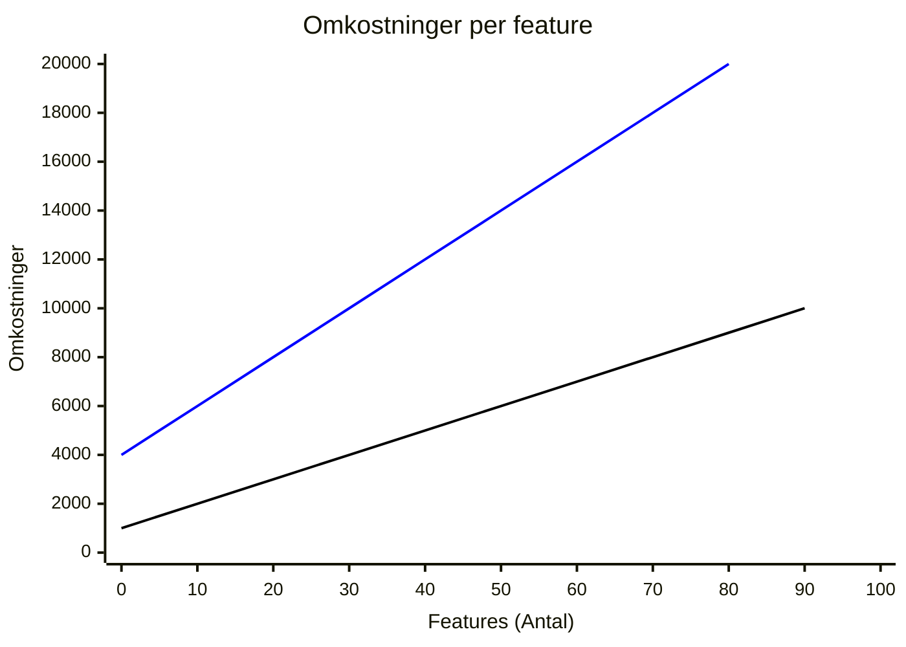

# Arkitektur

2 populære arkitekturer der bliver brugt i .NET til webudvikling er Clean Architecture (lagdelt arkitektur) og Vertical Slice Architecture (lodrette skiver).
Begge kan bruges i en monolit eller et distribueret system med en API eller ved brug af micro services.

# [Clean Architecture](#tab/ca)

**Fordele**  
Tydelig adskillelse af ansvar i hvert lag.

- Application Core
  - Entities
  - Interfaces
  - Domain Services

- Infrastructure
  - EF Core Typer
    - DbContext
    - Migrations
  - Data Access Implementations typer
    - Repositories
  - Infrastructure-specifike services
    - FileLogger
    - EmailService

- UI
  - Controllers
  - Views
  - ViewModels

Testbarhed:
Du kan teste UserService uafhængigt af databasen ved at mocke IUserRepository.

Udvidelighed:
Hvis du ønsker at udskifte EF Core med noget andet, behøver du kun ændre UserRepository.

Arbejder man på en feature, ved man præcis hvordan at den skal skæres/deles, da hver del af koden har en bestemt plads.
Hele kodebasen er bygget op på den samme måde, så det kan fungere som bander på en bowlingbane. Man holder sig inden for banen og skyder ikke ved siden af. Det kan give en mere ensartet kode, hvor man kender flowet på forhånd.
Ofte følger denne form for arkitektur SOLID principels og DRY til hvert punktum og komma.
De forskellige lag i applikationen kan nemt skiftes ud, da der er en løs kobling mellem lagene og brugen af interfaces typisk er høj, hvilket også gør det nemt at unit teste enkelte metoder.
Hvis et af målene er at man nemt kan skifte et lag ud, skal alle dele i det lag have et interface og unit testes.
Derved opnår man ikke kun at kontrakten mellem interface og implementiering overholdes, men også at omplementeringen af interfacet overholder kravene, da alle unit tests skal bestå, og man sikrer sig dermed at det er implementeret korrekt.

**Ulemper**  
Man er tvunget til at dele meget simpel kode ud på flere forskellige filer.
Koden er låst fast i det samme mønster igennem hele applikationen, allerede inden at man skriver det første stykke kode.
Nogle arktitekturer deler lagene med projekter frem for foldere, for at gøre det nemmere at skifte de forskellige lag ud, i tilfælde af at man skulle få brug for det engang i fremtiden.
Et typisk argument i .NET er at man nemmere kan skifte databasen ud med en anden, hvis man bruger repositories og interfaces for de selv samme repositories. Men Microsoft har udviklet en ORM (EF Core) som virker som et repository via DbContext, og den kan bruges på mange forskellige databaser.
Høj brug af interfaces og unit tests, hvilket gør det tidskrævende at implementere koden og samtidigt gør koden mere kompleks.

Pull requests: Det bliver mere uoverskueligt at gå igennem opdatering af kode der er skubbet til github og få et overblik og de dele af koden der er ændret. På samme måde er det også mere komplekst at godkende en pull request.

#### Clean Architecture eksempel


Jeg har inkludered eksempler på klasser i mapperne, for at illustrerer hvordan det ser ud i en meget lille applikation.
Man kan tænke sig til hvordan sværhedsgraden, i at finde rundt i de forskellige mapper, stiger liniært, i takt med at applikationen vokser.
Ikke kun på grund af antallet af mapper, men også pga antallet a filer der er i hver mappe.

I eksemplet har jeg lænet mig op af High Cohesion/Low Coupling, da relaterede emdpoints er samlet i en UserController, Service metoder er samlet i en UserService osv.
Der er low coupling i mellem lagene, via interfaces.

Fordelen ved at bruge class library projects er at hver del kan have deres egen afhængigheder og er isolerede i det enkelte class library project.
For eksempel er EF Core Nuget pakken isoleret i **Persistence** projektet i **Infrastructure** mappen.

#### Modelering

Det er muligt at modelerere på low-level, som [indsæt nogle navne på low-level diagrammer] niveau da man allerede har fastlagt programmeringsmønstre der skal følges.
Hvis fokus er på low-level design, så øger det kompleksiten ved at sikre sporbarhed imellem design diagrammer og kode.
En interesant bekymrer sig typisk ikke om hvordan at koden er implementeret, men har fokus på interactivitet.
Low-level design bør derfor kun benyttes, hvis en en udvikler vil modelere for at få et overblik over en feature, inden at den bliver implementeret.

#### Tests

Det er muligt at planlægge unit tests allerede inden at man har implementeret koden, da man ved hvilke dele der skal testes og hvad der skal testes for.
Hvilket gør det muligt for UTDD(TODO: internt link "Unit Test Driven Design").

Da det primære mål er at kunne skifte hele implementationen of Core laget ud, som er der hvor at alt forretningslogikken er placeret, er det ikke nok kun at dække det med interfaces.
Interfaces sikrer en meget begrænset kontrakt til dens implimentation, da den kun sørger for at retur type og argumenter bliver inplementeret.
Den sikrer dermed en 'happy path', men sikrer ikke 'edge cases'.
Ved at unit teste interfaces, kan man sikre at 'edge cases' også bliver sikret, hvis man har dækket alle interfaces i Core laget, med et Core test projekt.

Ved at dele applikationen i lag, har det ovenstående lag adgan til det nedenunder. Man kan så genbruge objekter fra det nedenstående lag, så man ikke skal gentage sig selv.
For at sikre sig at hvert objekt gør som det skal, kan  man bruge et interface og lave unit tests for det interface, så man er sikker på at alle konkrete implementeringer af interfacet overholder kontrakten og de regler der er sat op for det.
Man er mere eller mindre 'tvunget' til at bruge interfaces og unit tests, for at sikre sig at metoderne opfører sig korrek.  

# [Vertical Slice Arkitektur](#tab/vsa)

Man deler koden op i lodrette snit, typisk per feature, som er placeret i 1 folder.
I en serverside applikation hvor at både front- og backend kører på serveren, kan et snit bestå af en Blazor komponent og alt loggiken der hører til den specifike komponent.
I en WebAssembly applikation, som er delt op i flere projekter, vil man have foldere med det samme navn i hver projekt, som har alt hvad der er hører til den specifike feature.

#### Fordele

Det er nemmere at overskue en feature når det hele ligger i den samme folder, i stedet for at den er spredt over flere foldere og projekter.
I tilfælde at et distribueret system med et Client, Server og Shared projekt, kommer man ikke uden om at det bliver spredt ud, men det er stadig begrænset og folderne hedder det samme og er delt op på samme måde.

Da koden er delt op per feature bliver det nemmere, for udviklere der er nye til kodebasen, at sætte sig ind i hvordan den fungere.

Det bliver nemmere at debugge koden da alt relevant kode er samlet i den samme folder.

Der er ingen kobling imellem de forskellige feature snit, så en ændring i et snit kommer ikke til at påvirke et andet. Det har ingen sideeffekter, som er en ting der får det til at løbe koldt ned af ryggen på mange udviklere, når de skal skubbe kode til production.
Udviklere er mere frie til at implimentere den konkrete kode og løse problemerne på en måde de mener er bedst. En feature kan ses som en black box, hvor at man kan sende et request og få et response.
Man kan med sikker hånd implementere integration tests (TODO: Acceptence tests (automatiserede) ?), der går på tværs af forskellige dele af systemet, på det højeste niveau, da den berørte kode er samlet 1 sted. Som nævnt under (TODO: Ligger det her under tests eller hvor ?) [tests](Tests.md), så er de dele af koden som bliver brugt på tværs af snittene unit testet.

Man **KAN** bruge unit tests i en feature, men det er ikke påkrævet for at sikre sig at brugerens krav er overholdt.
Eksempler på hvor at det kunne være en fordel at implementere en unit test, kunne være hvis man har en meget kompleks metode/funktion, hvor man så kan køre den test for at se om den virker efter hensigten, frem for at skulle debugge den hver gang at man laver en ændring i den. Det er dog mere op til den enkelte udviklers præference, frem for et overordnet krav.
Man kan sammenligne det med at unit teste private metoder:
En privat metode understøtter en public metode og er derved en del af implementeringen af den public metode.
På samme måde er en metode i et snit, med til at understøtte en feature i at overholde kravende.

Pull request: Det er nemt at se hvad der er ændret tilbage i tiden da koden er samlet i de samme folder/foldere. På samme måde er det også mere overskueligt at godkende en pull request.

#### Ulemper

Da der ikke er nogen kode delt imellem lagene, vil man kunne komme ud for at skulle gentage sig selv :scream:, det taler imod [DRY](https://en.wikipedia.org/wiki/Don%27t_repeat_yourself) ( gentag ikke dig selv ). Regler er til for at brydes, og hvis man er en erfaren udvikler, vil man vide at det ikke alt tid giver mening at være regelrytter.

Delt forretningslogik vil man dog presse ned i domæne laget, i de tilfælde hvor det giver mening. TODO: ( SE: Hvordan man udvikler en feature )

#### TODO

SKRIV OM SÅ DET PASSER FOR VSA:
"Jeg har inkludered eksempler på klasser i mapperne, for at illustrerer hvordan det ser ud i en meget lille applikation.
Man kan tænke sig til hvordan sværhedsgraden, i at finde rundt i de forskellige mapper, stiger liniært, i takt med at applikationen vokser.
Ikke kun på grund af antallet af mapper, men også pga antallet a filer der er i hver mappe.

I eksemplet har jeg lænet mig op af High Cohesion/Low Coupling, da relaterede emdpoints er samlet i en UserController, Service metoder er samlet i en UserService osv.
Der er low coupling i mellem lagene, via interfaces.

Fordelen ved at bruge class library projects er at hver del kan have deres egen afhængigheder og er isolerede i det enkelte class library project.
For eksempel er EF Core Nuget pakken isoleret i **Persistence** projektet i **Infrastructure** mappen."

#### Modelering

Man kan holde det simpelt og fokusere på high-level diagrammer og på hvad interesanten gerne vil med applikationen.
Det er mere effektivt at lade udvikleren, der skal implementere en feature, om detaljerne.
Derved kan man lade koden diktere hvordan at den skal implementeres(link til Jimmi Bogard video).

Det er muligt at modelere på et low-level niveau, men oftest er det mere effektivt at bruge en [TDD](internt link) tilgang til endpoints, og så [lade koden diktere hvordan en feature skal implementeres](link til Jimmi Bogard video).

Derved kan man have mere tid og fokus på high-level diagrammer som betyder noget for interesanten, da de som oftest ikke har interesse i at vide hvordan at koden er implementeret.

#### Tests

Da hver feature mappe er isoleret fra de andre, kan man nemt debugge en feature for at finde en mulig fejl. Når man ændrer i koden, og får rettet op på fejlen, så er man sikker på at det ikke har sideeffekter til andre features.

Den mest effektive tilgang til tests ved VSA er en [ATDD](TODO:internt link) tilgang, med fokus på endpoints.
Man kan, men bør ikke fokusere på [unit tests](TODO: internt link), med mindre at man har komplekse objekter, hvor at det kan være tidsbesparende at skrive en test først, i stedet for at debugge for at være sikker på at den gør som den skal.

Da de forskellige features har adgang til domæne laget, er det værdifuldt at unit teste alt foretnings logik i domæne laget, for at sikre sig at den gør som den skal. 1 fejl i domænet kan have sideeffekter i flere features og vil ikke være isoleret til domænet selv.

#### Mapper

**Features (mappe)**  
Man vil starte med den simpleste implementering og **kun** lave abstraktioner **hvis** at det giver mening.  
Eksempler kan være hvis man vil øge læsbarheden eller at man har et komplekst objekt man gerne vil teste i isolation.
Det er op til udvikleren at implementere en feature med mindst mulig kompleksitet.

**Infrastructure (mappe)**  
Indeholder infrastrukturtjenester som logning, filopbevaring og email-tjenester.

**Persistence (mappe)**  
Indeholder database relaterede klasser som DbContext og Migrations.

**Domain (mappe)**  
Domæne-entiteter, der repræsenterer konkrete ting i systemet.

**Shared (Class library Project) (*Bruges kun ved Interactive WebAssembly*)**  
Indeholder dataoverførselsobjekter (DTO), der transporterer data mellem Client og Server, og kan inkludere valideringslogik.  
Ved at inkludere valdideringslogik og samtidigt bruge objekterne i både Client og Server, bruger man automatisk den samme validering begge steder.

---

# [CA Interactive Server eksempel](#tab/interactive-server/ca)


```plantuml
!define BG_COLOR_CHILD #FFF9B1
skinparam packageBackgroundColor BG_COLOR_CHILD

package "UI" {
  [Component.cs] as Component
  [ViewModel.cs] as ViewModel
  [Endpoint.cs] as Endpoint
}

Component --> ViewModel
ViewModel --> Endpoint

package "Infrastructure" {
  package "DataAccess" {
    [Repository.cs] as Repository
  }
  package "EfCore" {
    [DbContext.cs] as DbContext
    [Migrations.cs] as Migrations 
  }  
  package "InfrastructureServices" {
    [InfraService.cs] as InfraService
  }
}

package "ApplicationCore" {
  [IRepository.cs] as IRepository
  [IDomainService.cs] as IDomainService
  [DomainService.cs] as DomainService
  [IInfraServiceService.cs] as IInfraService
}

IDomainService ..> DomainService
DomainService --> IRepository
Endpoint --> IDomainService
IRepository ..> Repository
Repository --> DbContext
DomainService --> IInfraService
IInfraService ..> InfraService
Endpoint --> IInfraService
```

# [CA Interactive WebAssembly (TODO)](#tab/interactive-webassembly/ca)

CA interactive webassembly

# [VSA Interactive Server eksempel](#tab/interactive-server/vsa)


```plantuml
!define BG_COLOR_CHILD #FFF9B1
skinparam packageBackgroundColor BG_COLOR_CHILD

package "Simpel Feature" {
  [Component.razor] as SimpleComponent
}

package "Kompleks Fetature" {
  [Component.razor] as ComplexComponent
  [ViewModel.cs] as ComplexViewModel
  [IRepository.cs] as ComplexIRepository
  [Repository.cs] as ComplexRepository
}

ComplexComponent --> ComplexViewModel
ComplexViewModel --> ComplexIRepository
ComplexIRepository --> ComplexRepository
```

# [VSA Interactive WebAssembly eksempel](#tab/interactive-webassembly/vsa)


<div class="uml-vsa" style="display: flex;">
  <div class="uml-vsa__server">

<h5 style="text-align: center; margin-top: 5%">Simple Features</h5>

```plantuml
!define BG_COLOR #FFF9B1
skinparam packageBackgroundColor BG_COLOR
left to right direction
 
package "Client" {
  [Component.razor] as Component
}

package "Server" {
  [Endpoint.cs] as Endpoint
}

package "Shared" {
  [DTO.cs] as DTO
}

Client --> Shared
Server --> Shared
```

  </div>

<div class="uml-vsa__webassembly">
  <h5 style="text-align: center; margin-top: 5%">Komplekse Features</h5>

```plantuml
!define BG_COLOR #FFF9B1
skinparam packageBackgroundColor BG_COLOR

package "Client" {
  [Component.razor] as Component
  [Service.cs] as ClientService
}

package "Server" {
  [Endpoint.cs] as Endpoint
  [IService.cs] as IService
  [Service.cs] as Service
  [Mapper.cs] as Mapper
  [IRepository.cs] as IRepository
  [Repository.cs] as Repository
}

package "Shared" {
  [DTO.cs] as DTO
}

Component --> ClientService

ClientService --> Endpoint
Client --> DTO
Endpoint --> IService
IService --> Service
Service --> Mapper
Server --> DTO
Service --> IRepository
IRepository --> Repository
```

  </div>
</div>

---

#### CA VS VSA

Får man senere brug for at kunne skalere dele af applikationen kan man plukke enkelte fetatures ud som man kan lave til microservices.
Det er på bekostning af en højere kompleksitet.

Man ser ofte, når man læser om arkitektur, at en bestemt arkitektur passe godt til en bestemt størrelse.
Baseret på hvor kompleks den er, hvor nem den er at overskue, hvad teamet kender til, eller andre udvikler baserede parametre.
Men det er som nævnt baseret på hvad man tænker som udvikler.

Det der burde være i fokus er ikke noget af det overnævnte, men hvad kravene til applikationen er og hvad der passer sig bedst til applikationen. Jo mere kompliseret applikationen er, jo mere koster det at udvikle og vedligeholde.

Ting der kan øge omkstningerne og som man skal overveje inden:

- Navigere og overskue koden (man bruger mere tid på at læse kode en at skrive den)
- Tilføje en ny feature
- Ændre på en feature
- Antal af tests
- Antallet af abstraktioner
- Mængde af kode

**CA** (blå linie)  
Høj kompleksitet fra start, da man allerede inden at man har skrevet den første linje kode, har oprettet flere projekter i applikationen.
Hver feature der implementeres har høj kompleksitet der ikke kan gøres mere simpelt.

**VSA** (mellem blå og sort linie)
Lav komplesitet fra start.
Hver feature der implementeres er fleksibel og kan have lav eller høj kompleksitet.



Som udgangspunkt er det en go' ide at holde det simpelt(KISS link), og man skal ikke spekulere på hvad det måske kan udvikle sig til engang i fremtiden (YAGNY link), da det som udgangspunkt vil komplisere kodebasen og kompleksitet koster penge i implementering og vedligehold.
Der skal derfor være en meget god grund til at man vælger Clean Architektur, for at kunne retfærdigøre den øgede kompleksitet.

Med arkitektur i fokus, så er Vertical Slice rchitecture den mest simple at starte ud med.
Hver skive har 1 fokusområde og alt hvad den skive skal have er samlet i 1 folder.
Hvis man engang i fremtiden skulle få brug for at genbruge domæne delen af applikationen, så kan man opdatere 1 skive af gangen, indtil at man have et domæne der kan skilles fra resten af applikationen, udrulles og deles på tværs af andre projekter.

Repositories har sine fordele men er ikke altid bydende nødvendige. Især ikke når man kan bruge en ORM(Object Relational Mapper) som [EF CORE](https://learn.microsoft.com/en-us/ef/core/), der fungerer som data access lag til en database.
Skulle man få brug for at skifte til en anden database (YAGNY), så understøtter EF CORE mange [forskellige](https://learn.microsoft.com/en-us/ef/core/providers/?tabs=dotnet-core-cli) allerede via DbContext.

Når man afsøger kravene til applikationen, kan man i modeleringsfasen, dele applikationen op i dele som i [Feature Driven Development](/docs/Udvikling.html?tabs=fdd%2Ccontroller#tabpanel_1_fdd)
'Theme', 'Epic', 'Feature' og 'User Story', som så kan afspejle mappe strukturen i applikationen, hvilket giver sporbarhed imellem modelen og applikationen.
Udover at give sporbarhed, så er der heller ikke så giver det, som applikationen udvikler og udvider sig, en klar afgrænsning af domænet. Noget som ellers kan være svært at nå til enighed i et team.
På sigt kan, hvis applikationen bliver stor nok og det giver mening, en del af applikationen nemt skilles fra og håndteres som sin egen service, der kan bruges i andre applikationer.
